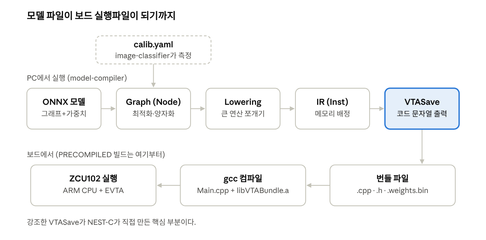
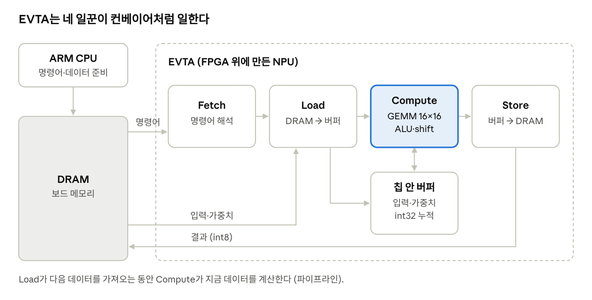

# NEST-C 공부 가이드: 이론부터 코드까지

대학교 1학년 수준에서 출발해 NEST-C가 만든 번들 코드를 한 줄씩 설명할 수 있게 되는 것을 목표로 한 8주 학습 자료.
[etri/nest-compiler](https://github.com/etri/nest-compiler)(마지막 커밋 2024-07-09)를 직접 읽고 썼으며, 예제의 계산은 모두 Python으로 검산했다.

## 목차

0. [이 가이드 사용법](#0-이-가이드-사용법)
1. [신경망이 하는 계산](#1장-신경망이-하는-계산)
2. [컴파일러란](#2장-컴파일러란)
3. [숫자 표현과 양자화](#3장-숫자-표현과-양자화)
4. [하드웨어: CPU, NPU, EVTA](#4장-하드웨어-cpu-npu-evta)
5. [NEST-C 코드 따라가기](#5장-nest-c-코드-따라가기)
6. [실습 과제](#6장-실습-과제)
7. [용어 사전과 추천 자료](#용어-사전과-추천-자료)

---

## 0. 이 가이드 사용법

**목표: 8주 뒤 "ResNet-18 번들의 conv 한 줄이 왜 그렇게 생겼는지" 스스로 설명할 수 있게 되는 것.**
각 장은 이론 → 쉬운 비유 → 손계산 예제 → NEST-C 코드 위치 → 확인 문제 순서로 되어 있다.

**필요한 선수지식** (지금 몰라도 되고, 진행하면서 채우면 된다)

- 고등학교 행렬 곱셈, 지수와 로그 (2^-6 = 1/64 정도)
- C 언어 기초: 배열, for문, 포인터, 함수
- 파이썬 기초와 numpy 배열 (6장 실습용)
- 2진수 (비트 시프트를 이해하기 위해)

**8주 로드맵**

| 주차 | 장 | 할 일 | 끝나면 할 수 있는 것 |
| --- | --- | --- | --- |
| 1–2 | 1장 신경망 계산 | 이론 읽기 + 실습 1 (numpy conv) | conv 출력 크기와 값을 손으로 계산 |
| 3 | 2장 컴파일러 | 이론 + Glow 그래프 덤프 보기 | "그래프 → IR → 코드" 흐름 설명 |
| 4 | 3장 양자화 | 이론 + 실습 2 (power2 실험) | 스케일로 int8 값 계산, shift 값 구하기 |
| 5 | 4장 하드웨어 | EVTA 구조 이해 | 왜 채널이 16의 배수여야 하는지 설명 |
| 6–7 | 5장 코드 | VTA.cpp, VTASave.cpp 읽기 + 실습 3 | 번들 .cpp의 한 줄을 소스 코드와 연결 |
| 8 | 6장 보드 실험 | 실습 4 (ZCU102) | 가설을 세우고 보드에서 확인 |

주당 5시간 정도를 가정한 일정이다. 모르는 단어는 맨 아래 용어 사전에서 먼저 찾아보고, 각 장의 확인 문제를 풀지 못하면 다음 장으로 넘어가지 않는다.

---

## 1장. 신경망이 하는 계산

**핵심: ResNet-18 같은 이미지 분류 신경망은 "곱하고 더하기"를 수십억 번 반복하는 것이다.** 다섯 가지 연산만 알면 번들 코드의 90%를 읽을 수 있다.

### 1-1. 텐서: 다차원 배열

이미지는 숫자 배열이다. 224×224 컬러 사진은 가로 224, 세로 224, 색 3개(R,G,B)라서 224×224×3 = 150,528개의 숫자다. 이런 다차원 배열을 **텐서**라고 부른다.

차원의 순서를 **레이아웃**이라 한다. N=배치(사진 장수), C=채널, H=높이, W=너비.

- NCHW: `[1, 3, 224, 224]` — "빨간 사진 전체, 초록 사진 전체, 파란 사진 전체" 순서. Caffe2 ResNet-50이 이 방식.
- NHWC: `[1, 224, 224, 3]` — "점 하나의 RGB, 다음 점의 RGB" 순서. Glow와 VTA 백엔드의 기본.

같은 150,528개 숫자라도 순서가 다르면 전혀 다른 사진이 된다. ResNet-50 디버그 출력의 `gpu_0_data_0` 크기 150528이 바로 이 값이다.

### 1-2. 행렬곱과 Fully Connected(FC)

FC 층은 "입력 벡터 × 가중치 행렬 + 편향"이다. ResNet-18의 마지막 FC는 512개 특징을 받아 1000개 클래스 점수를 만든다.

```math
y_j = \sum_{i=1}^{n} x_i \, w_{ij} + b_j
```

각 출력은 곱셈 n번과 덧셈 n번이다. 이 "곱하고 누적"을 **MAC**(Multiply-ACcumulate)이라 부르고, NPU는 MAC을 한꺼번에 많이 하는 기계다.

### 1-3. 합성곱(Convolution)

비유: 작은 돋보기(커널)를 사진 위에 한 칸씩 밀면서, 각 위치에서 겹친 숫자끼리 곱해 더한다. 커널은 "세로선 찾기", "모서리 찾기" 같은 특징 검출기다.

**손계산 예제** — 3×3 입력, 2×2 커널, stride 1, padding 0

```
입력 X          커널 K
1 2 0          1  0
0 1 3          0 -1
2 1 0
```

왼쪽 위: 1×1 + 2×0 + 0×0 + 1×(-1) = 0. 오른쪽 위: 2×1 + 0×0 + 1×0 + 3×(-1) = -1. 나머지도 같은 방법으로 하면 결과는 `[[0, -1], [-1, 1]]`이다.

출력 크기 공식 (H=입력 높이, K=커널, P=padding, S=stride):

```math
H_{out} = \left\lfloor \frac{H + 2P - K}{S} \right\rfloor + 1
```

실제 conv는 채널이 여러 개다. 입력 C채널 × 커널 KH×KW를 모두 곱해 더해야 출력 한 칸이 나오고, 커널이 KN개면 출력 채널도 KN개다. `VTASave.cpp`의 `N, H, W, C, KN, KH, KW, pad, stride`가 정확히 이 값들이다.

**중요한 사실: conv는 행렬곱으로 바꿀 수 있다 (im2col).** 커널이 덮는 영역을 한 줄로 펼치면 "영역 행렬 × 커널 행렬"이 된다. 그래서 행렬곱 전용 기계인 EVTA가 conv를 빠르게 처리할 수 있다 (4장).

### 1-4. ReLU, 풀링, Softmax

| 연산 | 하는 일 | 예 |
| --- | --- | --- |
| ReLU | 음수는 0, 양수는 그대로: max(0, x) | [-2, 3] → [0, 3] |
| MaxPool | 영역에서 가장 큰 값만 남김 (크기 축소) | 2×2 [1,5,3,2] → 5 |
| AvgPool | 영역 평균 | [1,5,3,2] → 2.75 |
| Add | 두 텐서를 원소별로 더함. ResNet의 "지름길(skip)" | x + F(x) |
| Softmax | 점수를 확률(합 1)로 바꿈 | [2, 1, 0.1] → [0.659, 0.242, 0.099] |

```math
p_i = \frac{e^{z_i}}{\sum_j e^{z_j}}
```

보드에서 본 "confidence 0.977876"이 바로 softmax 결과다. 반대로 VGG-19의 0.001002는 1/1000에 가까운데, 1000개 클래스 점수가 거의 같다는 뜻이다. 즉 신호가 중간에서 사라졌다는 증거다.

또 하나: conv 뒤에 ReLU가 바로 오면 합쳐서 한 번에 처리한다. 이걸 퓨전(fusion)이라 하고, 코드의 `doRelu`, `FusedActivation::RELU`가 그것이다.

### 확인 문제

1. 224×224 입력, 7×7 커널, stride 2, padding 3이면 출력 크기는? (ResNet 첫 conv. 답: 112)
2. 입력 64채널, 3×3 커널이면 출력 한 칸에 MAC이 몇 번? (답: 576)
3. softmax 결과가 모두 0.001 근처라면 어떤 일이 있었을까?

---

## 2장. 컴파일러란

**핵심: 컴파일러는 "사람이 쓴 것"을 "기계가 돌리는 것"으로 번역하는 프로그램이고, AI 컴파일러는 그 입력이 C 코드가 아니라 신경망 모델이다.**

### 2-1. 일반 컴파일러 (gcc)

`hello.c` → gcc → 실행파일. 안에서는 보통 세 단계를 거친다.

1. **프론트엔드**: 소스를 읽어서 컴퓨터가 다루기 쉬운 형태로 바꾼다.
2. **중간표현(IR) + 최적화**: 쓸데없는 계산을 지우고 빠르게 바꾼다. 예: `x*2` → `x<<1`.
3. **백엔드**: 특정 CPU(x86, ARM)의 명령어로 바꾼다.

가운데에 IR을 두는 이유: 언어가 M개, 기계가 N개일 때 M×N개 번역기가 아니라 M+N개만 만들면 된다.

### 2-2. AI 컴파일러는 무엇이 다른가

| | 일반 컴파일러 | AI 컴파일러 (Glow, NEST-C) |
| --- | --- | --- |
| 입력 | C 소스 코드 | ONNX 모델 파일 (연산 그래프 + 가중치) |
| 기본 단위 | 변수, 덧셈, if, for | 텐서, Conv, ReLU, FC |
| 최적화 예 | 반복문 풀기 | Conv+ReLU 합치기, BatchNorm을 Conv에 녹이기, 양자화 |
| 출력 | 기계어 | NPU 호출 코드 (번들) |

### 2-3. 그래프: 신경망을 표현하는 방법

신경망은 노드(연산)와 엣지(데이터가 흐르는 길)로 이뤄진 방향 그래프다. 예: `입력 → Conv → ReLU → MaxPool → ... → FC → Softmax`. ResNet은 중간에 지름길이 있어서 일직선이 아니다.

`-dump-graph-DAG=opt.dot` 옵션이 이 그래프를 파일로 내보낸다. `dot -Tpng opt.dot -o opt.png`로 그림으로 볼 수 있다 (Graphviz 필요).

### 2-4. Glow의 3단 구조

Glow(그리고 NEST-C)는 모델을 두 단계의 표현으로 내려보낸다.

1. **High-level Graph (Node)**: `ConvolutionNode`, `ReluNode`처럼 뜻이 큰 단위. 여기서 그래프 최적화와 양자화를 한다.
2. **Lowering**: 백엔드가 직접 못 하는 노드를 더 작은 노드로 쪼갠다. 예: BatchNorm → 곱셈+덧셈.
3. **Low-level IR (Instruction)**: `ConvolutionInst`처럼 메모리 주소가 정해진 명령어. "이 버퍼를 읽어서 저 버퍼에 써라".
4. **Backend**: IR 명령어 하나하나를 목표 기계의 코드로 바꾼다. CPU 백엔드는 LLVM을 거쳐 기계어를, **VTA 백엔드는 C++ 소스 코드 문자열을** 만든다.



윗줄은 PC에서 model-compiler가 하는 일이고, 아랫줄은 보드에서 하는 일이다. 지금 보드 빌드는 아랫줄만 하고 있다.

이름 규칙을 기억하면 코드 읽기가 쉬워진다: `~Node`는 1단계, `~Inst`는 3단계. `VTA.cpp`는 주로 Node를, `VTASave.cpp`는 주로 Inst를 다룬다.

### 2-5. Backend 클래스: 백엔드가 답해야 하는 질문들

새 NPU를 Glow에 붙이려면 `Backend` 클래스를 상속해 몇 가지 함수를 채우면 된다. C++의 **상속과 가상함수**가 쓰이는 고전적인 예다.

| 함수 | 백엔드가 답하는 질문 |
| --- | --- |
| `isOpSupported()` | 이 연산을 네가 할 수 있니? |
| `shouldLower()` | 이 노드를 더 작게 쪼갤까? |
| `transformPostLowering()` | 내 하드웨어에 맞게 그래프를 고칠 게 있니? |
| `save()` | 최종 코드를 파일로 내보내라 |

### 확인 문제

1. `ConvolutionNode`와 `ConvolutionInst`의 차이는?
2. 언어 3개, NPU 5개를 지원할 때 IR이 있으면 번역기가 몇 개 필요한가? 없으면? (답: 8개, 15개)

---

## 3장. 숫자 표현과 양자화

**핵심: EVTA는 소수점(float)을 못 다루고 8비트 정수(int8)만 계산한다. 그래서 모델의 모든 숫자를 정수로 바꿔야 하고, 이 과정이 양자화다.** 보드에서 겪는 문제는 대부분 여기서 생긴다.

### 3-1. float32와 int8

| 형식 | 크기 | 표현 범위 | 특징 |
| --- | --- | --- | --- |
| float32 | 4바이트 | 약 ±3.4×10^38, 소수 7자리 | 정확하지만 회로가 크고 느림 |
| int8 | 1바이트 | -128 ~ 127 (256개 값) | 회로가 작고 빠름, 메모리 1/4 |
| int32 | 4바이트 | 약 ±21억 | 곱셈 결과를 누적할 때 사용 |

int8 두 개를 곱하면 최대 127×127 = 16,129로 8비트를 넘는다. 그래서 곱셈 결과는 int32에 모으고(누적기), 마지막에 다시 int8로 줄인다. EVTA 비트스트림 이름의 `i8w8a32`가 바로 "입력 8비트, 가중치 8비트, 누적 32비트"라는 뜻이다.

### 3-2. 스케일: 자의 눈금 간격

비유: int8은 눈금이 256개만 있는 자다. 스케일(scale)은 눈금 한 칸이 실제로 몇인지를 정한다. 눈금을 촘촘하게 하면 정밀하지만 큰 값이 잘리고, 넓게 하면 큰 값은 담지만 작은 차이가 뭉개진다.

NEST-C가 쓰는 대칭(symmetric) 양자화의 식은 이렇다. r은 실제 값, q는 int8 값, s는 스케일이다.

```math
r \approx s \times q, \qquad q = \mathrm{round}\left(\frac{r}{s}\right), \qquad s = \frac{\max|r|}{127}
```

그럼 max|r|은 어떻게 아는가? 사진 몇 장을 float로 실제 돌려보고 각 층의 최대/최소를 기록한다. 이것이 보정(calibration)이고, 기록 파일이 `calib.yaml` 프로파일이다. ResNet-18 번들은 고양이 사진 한 장(`cat_285.png`)으로만 보정했다.

### 3-3. 2의 거듭제곱 스케일과 비트 시프트

EVTA에는 "스케일 곱하기" 회로가 없다. 대신 스케일을 전부 2의 거듭제곱(1/2, 1/4, 1/64 ...)으로 강제한다. 이것이 `symmetric_with_power2_scale`이다. 이유는 2진수에서 2^k로 나누기는 **오른쪽 시프트** 한 번이기 때문이다.

```
5000        = 0b1001110001000
5000 >> 9   = 0b1001  = 9      (5000 / 512 = 9.77, 소수점 이하 버림)
```

Glow는 계산한 스케일을 **더 큰 쪽의 가장 가까운 2의 거듭제곱**으로 올린다 (`lib/Quantization/Base/Base.cpp` 557행 근처).

**손계산 예제 1 — 값 양자화**

1. 어떤 층의 최댓값이 1.8이다. s = 1.8 / 127 = 0.01417
2. 2의 거듭제곱으로 올림: 2^-7 = 0.0078은 너무 작고, 2^-6 = 0.015625를 쓴다.
3. 값 0.37 양자화: q = round(0.37 / 0.015625) = round(23.68) = 24
4. 복원: 24 × 0.015625 = 0.375 (오차 0.005)

**손계산 예제 2 — conv 출력의 shift 값**

입력 스케일 2^-6, 가중치 스케일 2^-7이면 int8끼리 곱한 누적값의 스케일은 2^-6 × 2^-7 = 2^-13이다. 출력 스케일이 2^-4라면 누적값을 2^(13-4) = 2^9로 나눠야 하므로 shift = 9다.

```math
\mathrm{shift} = \log_2 \frac{s_{out}}{s_{in} \times s_{w}} = \log_2 \frac{2^{-4}}{2^{-6} \times 2^{-7}} = 9
```

`VTASave.cpp`의 `int shift = getExpofPowerofTwo(scale);`가 이 계산이다. 번들 .cpp에는 이 9 같은 숫자가 **상수로 박혀** 있어서 실행 중에 바꿀 수 없다. "실행 시점 수정으로는 못 고친다"고 판단한 근거가 이것이다.

### 3-4. 왜 정확도가 무너지는가

스케일을 올림하면 눈금이 최대 2배까지 넓어진다. 눈금 256개 중 절반 가까이를 못 쓸 수 있다는 뜻이다.

**예: 0~1 범위 입력.** s = 1/127 = 0.00787이다. 이는 2^-7 = 0.0078125보다 아주 조금 커서 2^-6 = 1/64로 올라간다. 그러면 입력 1.0은 q = 64가 되고, 실제로는 0~64, 즉 65단계만 쓴다. 256단계 중 약 1/4이다.

이런 손실이 50개 층에 걸쳐 쌓이면 신호가 사라질 수 있다. 또 shift가 너무 크면 모든 값이 0이 되고, 그러면 입력이 무엇이든 출력은 편향(bias)만 남아 **항상 같은 결과**가 나온다. ResNet-50의 "입력 무관 고정 출력 619"를 생각할 때 가장 먼저 떠올려야 할 시나리오다 (가설이지 결론은 아님).

NEST-C의 대책 하나는 앞쪽 층 몇 개를 양자화하지 않고 float로 CPU에서 돌리는 것이다. ResNet-18은 `VTASkipQuantizeNodes.txt`에 전처리, 첫 conv, 첫 relu를 적어두었다 (5장).

### 확인 문제

1. 최댓값이 10인 층의 power2 스케일은? (힌트: 10/127 = 0.0787. 답: 2^-3 = 0.125)
2. s_in = 2^-5, s_w = 2^-8, s_out = 2^-3이면 shift는? (답: 10)
3. shift를 실제보다 3 크게 했다면 출력 값은 어떻게 되나? (답: 1/8로 작아짐)

---

## 4장. 하드웨어: CPU, NPU, EVTA

**핵심: EVTA는 "16×16 int8 행렬곱"만 엄청 빠르게 하는 전용 회로이고, NEST-C의 하는 일 대부분은 모델을 이 모양에 맞게 자르고 재배치하는 것이다.**

### 4-1. CPU vs NPU

비유: CPU는 무엇이든 할 수 있는 요리사 몇 명, NPU는 감자만 깎는 기계 수백 대다. 감자 깎기(행렬곱)는 NPU가 훨씬 빠르지만, 양념 만들기(softmax, 전처리)는 못 한다. 그래서 실제 번들은 일부는 NPU, 일부는 ARM CPU가 나눠 처리한다.

| | CPU (ZCU102의 ARM Cortex-A53) | NPU (EVTA) |
| --- | --- | --- |
| 잘하는 것 | 분기, 복잡한 연산, float | 대량의 int8 MAC |
| 못하는 것 | 대량 병렬 곱셈(느림) | if문, float, 복잡한 연산 |
| NEST-C에서 | softmax, float conv, 전처리 | conv, FC의 int8 행렬곱 |

### 4-2. FPGA란

FPGA는 "다시 연결할 수 있는 회로판"이다. 비트스트림(.bit) 파일을 올리면 그 안의 논리 게이트가 그대로 연결되어 하나의 칩처럼 동작한다. ZCU102의 XCZU9EG는 ARM CPU(PS)와 FPGA(PL)가 한 칩에 들어 있고, 부팅하면 `BOOT.BIN`에 들어 있는 비트스트림이 PL에 EVTA를 만든다.

### 4-3. EVTA의 구조

EVTA는 TVM 프로젝트의 오픈소스 NPU인 VTA를 ETRI가 확장한 것이다 (이름의 E). VTA는 네 개의 일꾼이 컨베이어 벨트처럼 일한다.

1. **Fetch**: CPU가 DRAM에 써둔 명령어를 가져와 나눈다.
2. **Load**: DRAM에서 입력과 가중치를 칩 안의 작은 버퍼(SRAM)로 옮긴다.
3. **Compute**: GEMM 코어가 16×16 행렬곱을 하고, ALU가 덧셈, max, 시프트를 한다. 결과는 int32 누적 버퍼에 쌓인다.
4. **Store**: int8로 줄인 결과를 DRAM에 돌려놓는다.



계산은 강조한 Compute에서만 일어나고, 나머지 세 단계는 데이터를 나르는 일이다. 네 단계가 동시에 돌기 때문에 (다음 데이터를 Load하는 동안 지금 데이터를 Compute) 빠르다. 이를 **파이프라인**이라 한다.

비트스트림 이름 `zcu102_1x16_i8w8a32_16_16_19_18`은 이렇게 읽는다. `1x16`은 배치 1 × 블록 16(한 번에 16×16 행렬곱), `i8w8a32`는 3장에서 본 비트 폭이다. 뒤의 네 숫자는 칩 안 버퍼 크기 설정으로 보이는데, 정확한 의미는 확인하지 못했다.

### 4-4. 왜 채널이 16의 배수여야 하나

GEMM 코어는 한 번에 "입력 16개 × 가중치 16×16"만 처리한다. 채널이 64면 16씩 4덩어리로 딱 나뉘지만, 3(RGB)이면 안 나뉘어 0으로 채워야(padding) 한다. 그러면 16칸 중 13칸이 낭비다.

그래서 3채널 입력을 받는 첫 conv는 CPU에서 도는 경우가 많다. NEST-C의 `NonVTAConvTest` 번들이 바로 이 층(3채널, 7×7)을 CPU 함수 `nonvtaconvolution`으로 처리하고, ResNet-18 번들은 이 층을 아예 양자화하지 않고 float로 돌린다. `VTA.cpp`의 `optimizeVTAConv()`도 채널이 16으로 나누어떨어지지 않으면 변환을 포기한다.

### 4-5. 데이터 재배치 (6차원 레이아웃)

GEMM 코어가 16개씩 묶어 읽으려면 메모리에도 16개가 붙어 있어야 한다. 그래서 NEST-C는 가중치 `[N, H, W, C]`를 6차원 `[N/16, C/16, H, W, 16, 16]`으로 바꾼다. 비유하면, 책을 제목 순이 아니라 "16권짜리 상자" 단위로 다시 꽂는 것이다.

이 재배치는 컴파일 때 한 번 끝내두고, 입력과 출력은 실행 중에 Transpose로 재배치한다. 번들에 보이는 `_input_transpose`, `_output_bef_transpose`가 그 흔적이다.

### 확인 문제

1. 입력 채널 256, 출력 채널 512인 conv를 돌리려면 16×16 블록이 커널 위치 하나당 몇 개 필요한가? (답: 16 × 32 = 512개)
2. 왜 softmax는 EVTA가 아니라 CPU에서 하는가?

---

## 5장. NEST-C 코드 따라가기

**핵심: 읽을 파일은 네 개다. CMakeLists.txt(무엇을 실행하나), VTA.cpp(무엇을 NPU로 보내나), VTASave.cpp(어떤 코드를 쓰나), 그리고 결과물인 번들 .cpp.** 나머지 12만 줄은 필요할 때 찾아보면 된다.

### 5-1. 저장소 지도

| 위치 | 내용 | 우선순위 |
| --- | --- | --- |
| `lib/Backends/VTA/VTA.cpp` | 지원 연산 판단, conv 변환 (650줄) | 1 |
| `lib/Backends/VTA/VTASave.cpp` | 번들 C++ 코드 생성 (5,100줄) | 1 |
| `vta/bundles/*/CMakeLists.txt` | 번들을 만드는 명령 | 1 |
| `lib/Quantization/` | 양자화 스케일 계산 | 2 |
| `lib/Converter/FunctionConverter.cpp` | 양자화 제외 목록 읽기 | 2 |
| `tools/loader/` | model-compiler, image-classifier 본체 | 2 |
| `lib/Backends/VTAInterpreter/` | EVTA를 PC에서 흉내 내는 백엔드 | 3 |
| `lib/Partitioner/` | CPU/NPU 분할 (PartitionTuner) | 3 |
| `lib/Backends/Relay, Newton, Enlight, NMP` | TVM 연동, 협력사 NPU | 나중에 |

`glow/`와 `tvm/`은 비어 있는데, git 서브모듈(다른 저장소를 끼워 넣은 것)이기 때문이다. NEST-C는 cmake 때 `cmake/glow/`를 `glow/` 위에 복사해서 Glow 파일 일부를 자기 버전으로 덮어쓴다.

### 5-2. 빌드 명령 읽기 (Resnet18Test/CMakeLists.txt)

1. `image-classifier ... -backend=VTAInterpreter -dump-profile=calib.yaml` — 고양이 사진으로 보정해서 프로파일을 저장한다 (3장).
2. `model-compiler -backend=VTA -load-profile=calib.yaml -quantization-schema=symmetric_with_power2_scale -emit-bundle=...` — 양자화하고 번들을 만든다.
3. `add_executable(... Main.cpp resnet18.cpp)` — gcc로 묶어 실행파일을 만든다.

보드 빌드(`NESTC_USE_PRECOMPILED_BUNDLE=ON`)는 1, 2를 건너뛰고 ETRI가 만들어 올려둔 결과를 내려받는다.

### 5-3. VTA.cpp: "무엇을 NPU로 보낼까"

`isOpSupported()`는 거대한 switch문이다. 예를 들어 Conv는 입력이 int8이고 bias가 int8 또는 int32일 때만 지원한다고 답한다.

`optimizeVTAConv()`는 4장의 6차원 재배치를 실제로 하는 함수다. 핵심은 이 네 줄 for문이다.

```cpp
for (c0 ...) for (c1 ...) for (c2 ...) for (c3 ...)
  F8H.at({c0 / 16, c3 / 16, c1, c2, c0 % 16, c3 % 16}) = FH.at({c0, c1, c2, c3});
```

`c0 / 16`은 "몇 번째 상자", `c0 % 16`은 "상자 안의 몇 번째"다. 나눗셈과 나머지로 인덱스를 쪼개는 것은 타일링(tiling)의 기본 기술이다. 단, 이 변환은 `#ifdef NESTC_EVTA_GRAPH_OPT`일 때만 켜진다.

### 5-4. VTASave.cpp: 코드를 문자열로 쓰는 컴파일러

이 파일은 IR 명령어를 하나씩 보면서 `bundle->append("...")`로 C++ 문장을 이어 붙인다. `ConvolutionInst`를 만나면 `saveConvolutionInst()` → `generateVTAConvolutionCall()`이 불리고, 다음 계산을 한 뒤 함수 호출 한 줄을 출력한다.

```cpp
float scale = (inScale * filterScale) / outScale;  // 실제로는 역수를 취해 계산
int shift = getExpofPowerofTwo(scale);             // 3장 예제 2의 그 shift
bundle->append("  convolution_wo_tr(");           // 함수 이름을 문자열로 씀
```

또 bias가 전부 0이면 `doBias = false`로 편향 덧셈을 생략하는 것처럼, 작은 최적화도 여기서 한다.

### 5-5. 실제 번들 한 줄 해독

`vta/bundles/NonVTAConvTest/vtaNonVTAConvTestBundle.cpp`는 저장소에 들어 있는 진짜 번들이다. ResNet의 첫 conv 하나만 있다.

```cpp
int8_t* filterP = constantWeight + 0;
int8_t* biasP   = constantWeight + 9408;
int8_t* inputP  = mutableWeight + 0;
int8_t* outP    = mutableWeight + 150528;
nonvtaconvolution(inputP, 1.0/32, 0, filterP, 1.0/64, 0, biasP, 1.0/2048, 0,
                  outP, 1.0/8, 0, 1, 224, 224, 3, 64, 7, 7, 3, 2, ...);
```

지금까지 배운 것으로 모든 숫자를 설명할 수 있다.

| 숫자 | 뜻 | 검산 |
| --- | --- | --- |
| 9408 | 가중치 바이트 수 | 64 × 7 × 7 × 3 = 9,408 (커널 64개, 7×7, 3채널) |
| 150528 | 입력 바이트 수 | 224 × 224 × 3 (NHWC) |
| 1.0/32, 1.0/64 | 입력, 가중치 스케일 | 둘 다 2의 거듭제곱 (2^-5, 2^-6) |
| 1.0/2048 | bias 스케일 | 2^-5 × 2^-6 = 2^-11 = 1/2048. bias는 누적값에 더해지므로 누적 스케일과 같아야 한다 |
| 1.0/8 | 출력 스케일 | shift = log2((1/8) / (1/2048)) = 8 |
| 224, 224, 3, 64, 7, 7, 3, 2 | H, W, C, KN, KH, KW, pad, stride | 출력 = ⌊(224 + 6 − 7) / 2⌋ + 1 = 112 |

출력 크기 112 × 112 × 64 = 802,816바이트이고, 이는 파일 위쪽 심볼 테이블의 `{"outP",150528,802816}`과 정확히 일치한다.

### 5-6. 양자화 제외 목록

`FunctionConverter.cpp`는 양자화할 때 현재 디렉터리의 `./VTASkipQuantizeNodes.txt`를 열고, 거기 이름이 적힌 노드는 건너뛴다. ResNet-18은 `resnetv10_conv0_fwd__2`(첫 conv)와 `resnetv10_relu0_fwd__1`(첫 relu), 전처리 노드 두 개를 적어두었다. 이들은 float로 남아 CPU에서 돈다.

참고로, 파일을 현재 디렉터리에서 찾는 방식은 보드의 가중치 파일도 같다. 그래서 반드시 `cd` 후 실행해야 한다.

### 확인 문제

1. 출력 스케일이 1/4였다면 위 번들의 shift는? (답: 9)
2. `c0 = 37`이면 몇 번째 상자의 몇 번째인가? (답: 2번 상자의 5번째, 0부터 셀 때)
3. bias 스케일이 왜 입력 스케일 × 가중치 스케일이어야 하는가?

---

## 6장. 실습 과제

**핵심: 손으로 짠 코드가 NEST-C의 코드와 같은 숫자를 내는 것을 확인하는 것이 목표다.** 실습 1–3은 PC(WSL)에서, 실습 4는 ZCU102에서 한다.

### 실습 1. numpy로 conv 직접 구현 (1–2주)

```python
import numpy as np

def conv2d(x, k, stride=1, pad=0):
    x = np.pad(x, pad)
    H, W = x.shape; K = k.shape[0]
    Ho = (H - K) // stride + 1; Wo = (W - K) // stride + 1
    out = np.zeros((Ho, Wo))
    for i in range(Ho):
        for j in range(Wo):
            patch = x[i*stride:i*stride+K, j*stride:j*stride+K]
            out[i, j] = (patch * k).sum()
    return out

x = np.array([[1,2,0],[0,1,3],[2,1,0]])
k = np.array([[1,0],[0,-1]])
print(conv2d(x, k))   # [[0,-1],[-1,1]] 이 나오면 성공
```

이어서 해볼 것:

- [ ] 입력을 여러 채널 (H, W, C)로, 커널을 (KN, KH, KW, C)로 확장하기
- [ ] stride=2, pad=3으로 224×224 입력에 7×7 커널을 적용해 출력이 112인지 확인
- [ ] ReLU와 2×2 MaxPool 함수도 직접 만들기

### 실습 2. power2 양자화가 잃는 것 측정 (4주)

```python
import numpy as np, math

def power2_scale(max_abs):
    return 2 ** math.ceil(math.log2(max_abs / 127))

def quantize(r, s):
    return np.clip(np.round(r / s), -128, 127).astype(np.int8)

data = np.random.default_rng(0).uniform(0, 1, 10000)   # 0~1 입력 흉내
for name, s in [("일반", data.max() / 127), ("power2", power2_scale(data.max()))]:
    q = quantize(data, s)
    print(name, s, len(np.unique(q)), np.abs(q * s - data).mean())
```

실제 실행 결과:

| 스케일 | s | 사용한 단계 수 | 평균 오차 |
| --- | --- | --- | --- |
| 일반 (max/127) | 0.007874 | 128 | 0.00196 |
| power2 | 0.015625 | 65 | 0.00389 |

0~1 입력에서는 power2 스케일이 단계를 절반만 쓰고 오차는 2배가 된다. (양수만 있는 데이터라 일반 스케일도 음수 쪽 128개는 못 쓴다.)

- [ ] `uniform(0, 255)`로 바꿔서 다시 재기. 어느 쪽이 손실이 적은가?
- [ ] 양자화된 값으로 실습 1의 conv를 정수만으로 계산하고, 마지막에 `>> shift`로 줄여 float 결과와 비교하기

### 실습 3. 번들 .cpp 해독 (6–7주)

- [ ] 5-5의 표를 보지 않고 `NonVTAConvTest` 번들의 모든 숫자를 설명하기
- [ ] 보드의 `mxnet_exported_resnet18.cpp`에서 `convolution` 호출을 모두 찾아 순서대로 층 크기(H, W, C, KN)를 표로 정리하기. `grep -n convolution *.cpp`
- [ ] 같은 표를 ResNet-50 번들(`resnet50.cpp`)로도 만들고, 각 층의 shift 값과 스케일을 나란히 적기. shift가 유독 큰 층이 있는가?

### 실습 4. ZCU102에서 가설 확인 (8주)

ResNet-50의 "입력 무관 고정 출력"에 대해 코드를 읽으며 세운 가설 두 개를 직접 확인해본다. 둘 다 아직 검증되지 않았다.

1. **라이브러리 종류 불일치.** `docs/nestc/evta.md`는 ZCU102에서 ResNet-50을 `NESTC_EVTA_RUN_WITH_GENERIC_BUNDLE=ON`으로, ResNet-18은 `OFF`로 빌드하라고 적어두었다. 이 값에 따라 링크되는 `libVTABundle.a`가 generic과 acl 버전으로 달라진다.
    - 확인: `grep GENERIC_BUNDLE exec1/CMakeCache.txt`
2. **첫 층 양자화 손실.** ResNet-50은 0~1 입력에 양자화 제외 목록이 없다 (실습 2에서 본 손실).
    - 확인: 실습 3의 shift 표, `partition_profile_*` 번들로 층별 출력 추적

가설을 확인하는 순서도 공부다. 비용이 가장 적은 것(grep 한 줄)부터 하고, 결과를 기록한다.

---

## 용어 사전과 추천 자료

| 용어 | 한 줄 설명 | 처음 나오는 곳 |
| --- | --- | --- |
| 텐서 | 다차원 숫자 배열 | 1-1 |
| NCHW / NHWC | 텐서 차원의 순서 (레이아웃) | 1-1 |
| MAC | 곱하고 누적하기. NPU 성능의 단위 | 1-2 |
| im2col | conv를 행렬곱으로 바꾸는 기법 | 1-3 |
| 퓨전 (fusion) | 연산 여러 개를 하나로 합침. 예: Conv+ReLU | 1-4 |
| IR | 컴파일러 내부의 중간표현 | 2-1 |
| Lowering | 큰 연산을 작은 연산으로 쪼개기 | 2-4 |
| 백엔드 | 특정 하드웨어용 코드 생성기 | 2-4 |
| 번들 | NEST-C가 만든 .cpp + .h + .weights.bin 묶음 | 2-4 |
| 양자화 | float를 int8 같은 작은 정수로 바꾸기 | 3장 |
| 스케일 | int8 한 칸이 실제로 얼마인지 | 3-2 |
| 보정 (calibration) | 샘플 입력으로 각 층의 값 범위를 측정 | 3-2 |
| shift | 2^k로 나누기를 비트 이동으로 처리 | 3-3 |
| FPGA / 비트스트림 | 재연결 가능한 회로판 / 그 연결 설계도 | 4-2 |
| GEMM | 행렬곱 (General Matrix Multiply) | 4-3 |
| 타일링 | 큰 텐서를 하드웨어 크기(16) 조각으로 나누기 | 4-5 |
| 파티셔닝 | 모델을 나눠 CPU와 NPU에 배정 | 5-1 |

**추천 자료** (코드 위치는 직접 확인했고, 논문과 강의는 이름만 알려준 것이니 검색해서 찾을 것)

1. **신경망 직관**: 3Blue1Brown "Neural Networks" 영상 시리즈 (1장과 함께)
2. **CNN**: Stanford CS231n 강의 노트의 Convolutional Networks 파트 (1장)
3. **Glow 논문**: "Glow: Graph Lowering Compiler Techniques for Neural Networks" (2018, arXiv) (2장)
4. **양자화**: Jacob et al., "Quantization and Training of Neural Networks for Efficient Integer-Arithmetic-Only Inference" (CVPR 2018) (3장)
5. **VTA**: Moreau et al., "A Hardware-Software Blueprint for Flexible Deep Learning Specialization" (2019), 그리고 TVM 문서의 VTA 파트 (4장)
6. **NEST-C 자체**: [etri/nest-compiler](https://github.com/etri/nest-compiler)의 `docs/nestc/` 폴더 (evta.md, quantization.md, NestPartitioner-kor.md), 그리고 README에 연결된 ETRI 논문 PartitionTuner(ETRI Journal 2023), Quantune(FGCS 2022) (5장)
